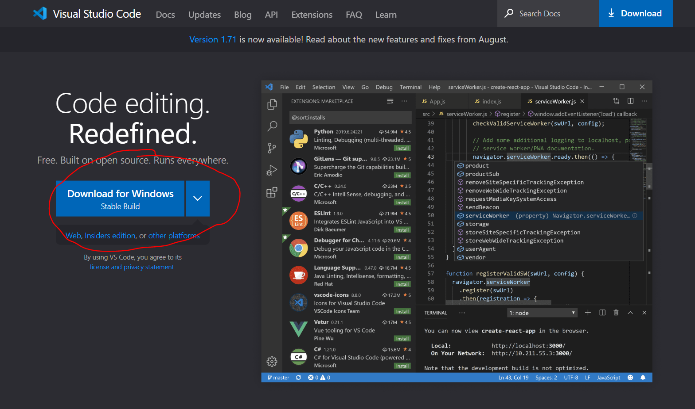
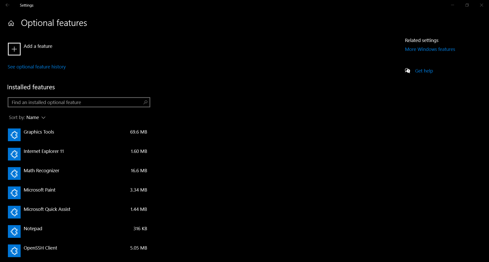
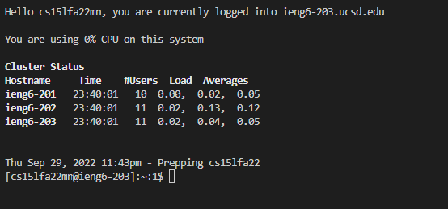
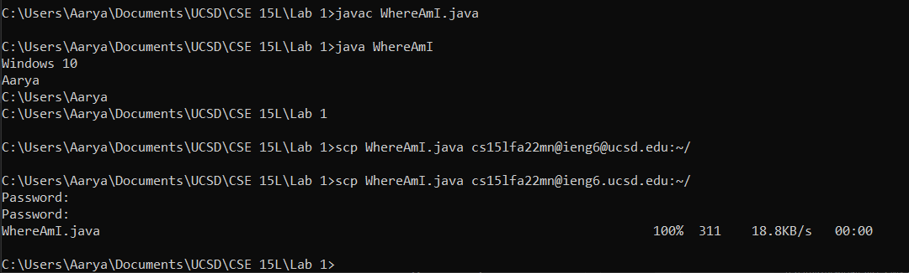
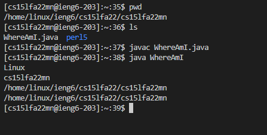
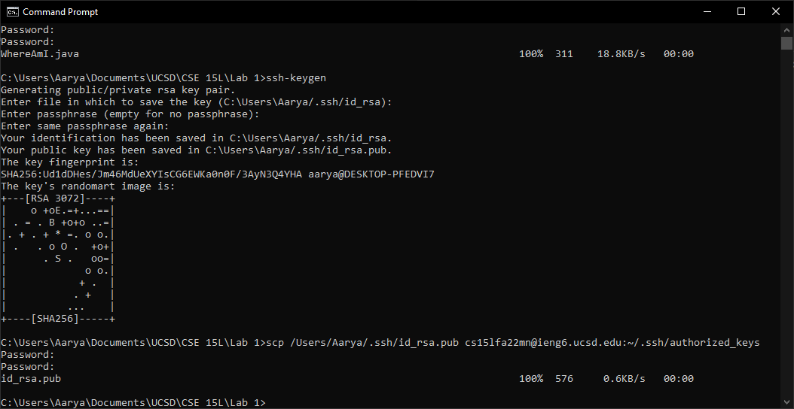
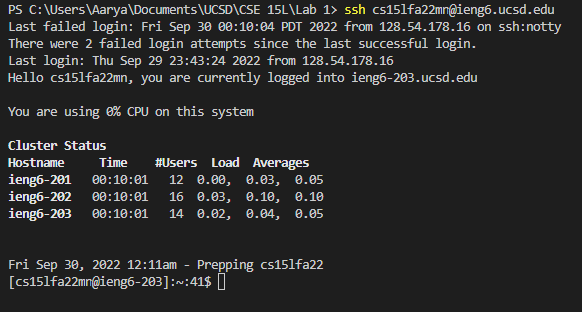
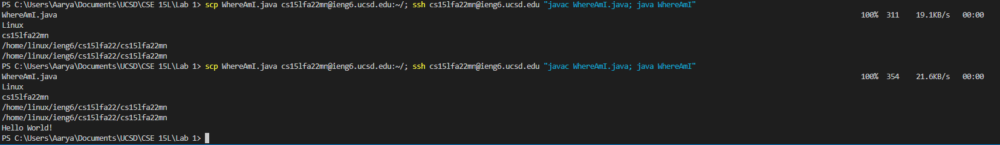

# Lab 1 Report

## Installing VS Code
VS Code is already installed on my computer, but if you need to install it again, use the link below:

[https://code.visualstudio.com/](https://code.visualstudio.com/)



Click on the Download for Windows button circled in red, or find the correct app for your system by clicking on the down arrow on the right.
## Remotely Connecting
First OpenSSH must be installed on your computer. It is already installed in mine.
However, if you open Settings > Apps > Optional features. Search under "Installed features", for "OpenSSH Client". If it's there great! Otherwise, click on "Add a feature" and install it.


Then open VS Code. Click on Terminal > New Terminal.
 


**Make sure you type "ssh cs15lfa22XX@ieng6.ucsd.edu" where XX are the unique 2 letters for yuor account.**

Then you will be prompted to enter a password. Initally, my account did not work after I reset my password once. However, several hours later, I decided to reset my password again to something new and now the remote login works!

## Trying Some Commands
There are several commands you can try on the server like `cd`, `ls`, `pwd`, and more. For instance, try seeing what directories you can `cd` into. I used `cd ..` and `ls` to see which other folders there were as I went up the file system. There is a "staff" folder with more folders inside. I assume the permission to view them would be denied but I did not test this.


## Moving Files with `scp`
I opened a separate terminal on my computer for `scp`. This is so I didn't have to log out of the remote on VS Code, and then have to re-enter the password later!


After compling and running `WhereAmI.java`, we can see that the output is based off my system and the current directory.

The format for `scp` commands is:

```scp <file name> cse15lfa22XX@ieng6.ucsd.edu:<directory>```

For the directory in the image, `~/` is the home directory.



Now observe that after using `scp` on my *local* computer, I can use `ls` and see `WhereAmI.java` on the *remote* computer. After compiling and running the code, we can see that the output of the program differs based off the system.

## Setting an SSH Key

For this step make sure you first type `ssh-keygen` on your *local* terminal. Then you can press enter for the file and passphrase (leave it empty). Next you'll type in the above `scp` command to send the *public* key to the remote server. You will need to enter your password for this `scp` command.



Now you are able to `ssh` into the remote server without a password!

## Optimizing Remote Running
Consider the following line:

```scp WhereAmI.java cs15lfa22XX@ieng6.ucsd.edu:~/; ssh cs15lfa22XX@ieng6.ucsd.edu "javac WhereAmI.java; java WhereAmI"```

Semicolons can be used to write multiple commands on one line. So first the `scp` command is ran, copying the file to the server. Then the `ssh` command with the quotes is ran. Since there are quotes, only the commands within them are ran, and then the remote is exited. Once again, the commands with quotes have a semicolon, so those commands will run one after another.

So assuming a programmer has already typed out the line above before, they only need to press the up arrow *once* and then press enter (2 key strokes) to save, and then run, a local file to remote. 

In the image below, I can repeat this command twice in about 4 to 5 keystrokes:



