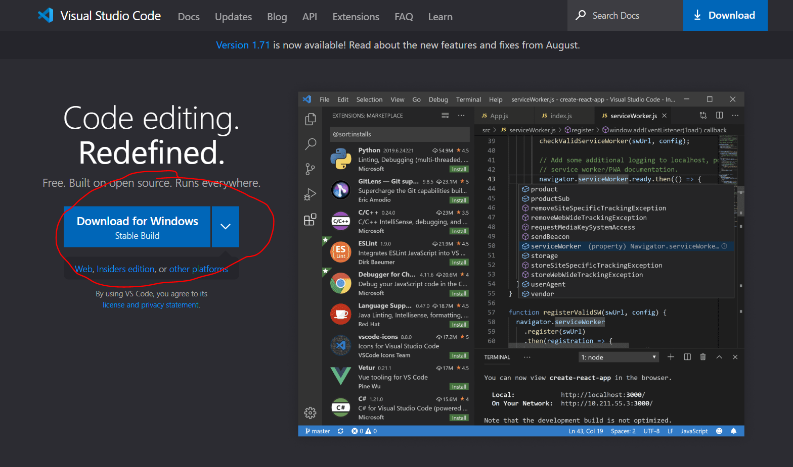
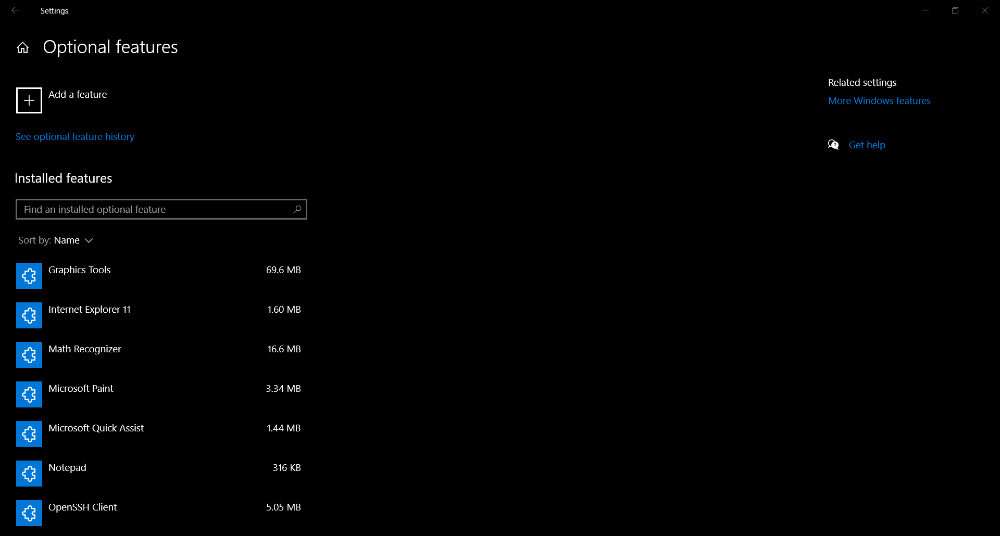
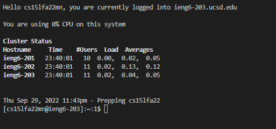
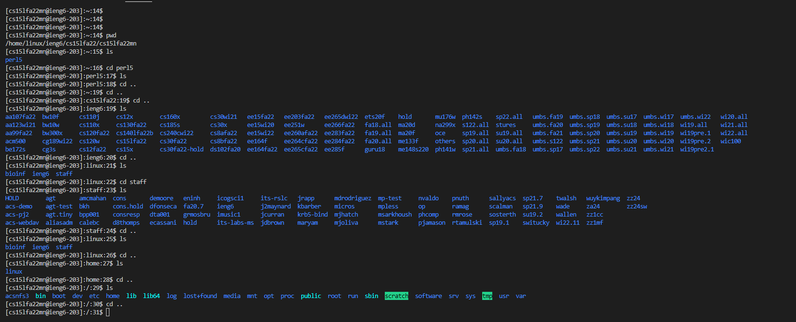
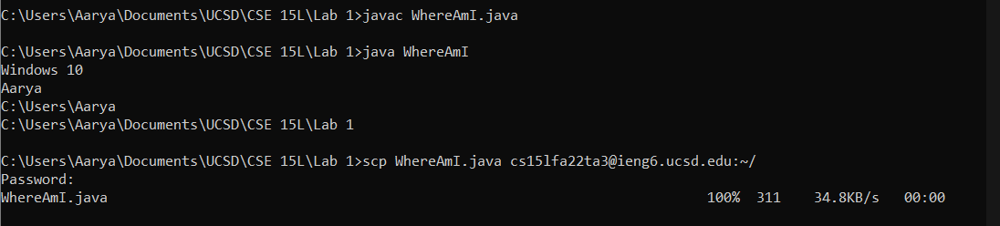
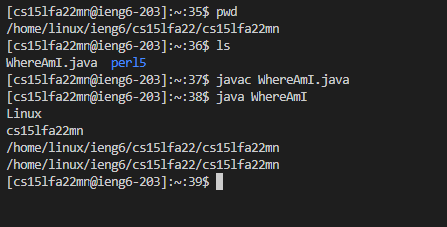

# Lab 1 Report

## Installing VS Code
VS Code is already installed on my computer, but if you need to install it again, use the link below:
[https://code.visualstudio.com/](https://code.visualstudio.com/)



Click on the Download for Windows button circled in red, or find the correct app for your system by clicking on the down arrow on the right.
## Remotely Connecting
First OpenSSH must be installed on your computer. It is already installed in mine.
However, if you open Settings > Apps > Optional features. Search under "Installed features", for "OpenSSH Client". If it's there great! Otherwise, click on "Add a feature" and install it.


Then open VS Code. Click on Terminal > New Terminal.
 


**Make sure you type "ssh cs15lfa22XX@ieng6.ucsd.edu" where XX are the unique 2 letters for yuor account.**

Then you will be prompted to enter a password. To this day, the login does not work despite me following all the steps on the ETS website. To continue with the lab I used a TA account. This is why my screenshots have the server account end in "ta3" instead of 2 lowercase letters, as it would be for a normal student account.

## Trying Some Commands
There are several commands you can try on the server like `cd`, `ls`, `pwd`, and more. For instance, you can try `cd`ing into other directories. On the TA account, I could `cd` and `ls` other directories that weren't mine. I am unsure if that is unique to TA and faculty accounts, or if a student account could do the same thing.

In this image, starting at command $42, I `ls`-ed my original student account (ending in "mn"), and saw that there was nothing in it (which makes sense). I then `ls`-ed into the "ta5" account and was able to see their files. Finally, I just used `ls` in my home directory, and the used `cat` to see what was in the `hello.txt` file.

## Moving Files with `scp`
I opened a separate terminal on my computer for `scp`. This is so I didn't have to log out of the remote on VS Code, and then have to re-enter the password later!


After compling and running `WhereAmI.java`, we can see that the output is based off my system and the current directory.

The format for `scp` commands is:

```scp <file name> cse15lfa22XX@ieng6.ucsd.edu:<directory>```

For the directory in the image, `~/` is the home directory.



Now observe that after using `scp` on my *local* computer, I can use `ls` and see `WhereAmI.java` on the *remote* computer. After compiling and running the code, we can see that the output of the program differs based off the system. (You can see the `WhereAmI.java` program code in the image in the "Trying Some Commands" section).

## Setting an SSH Key
Since I was working on the TA account, I was unable to create my own SSH keys. Once my own account's login begins working I can complete this step.
## Optimizing Remote Running
Once again, since I was using the TA account, I was unable to begin working on this step either. Once class time for the lab ran out, I couldn't continue being on the TA account and try out saving local edits remotely in as few keystrokes as possible.

However, I can speculate what could be an easy way to make some saves.

Consider the following line:

```scp WhereAmI.java cs15lfa22XX@ieng6.ucsd.edu:~/; ssh cs15lfa22XX@ieng6.ucsd.edu "javac WhereAmI.java; java WhereAmI"```

Semicolons can be used to write multiple commands on one line. So first the scp command is ran, transfering the file to the server. Then the ssh command with the quotes is ran. Since there are quotes, only the commands within them are ran, and then the remote is exited. Once again, the commands with quotes have a semicolon, so those commands will run one after another.

So assuming a programmer has already typed out the line above before, they only need to press the up arrow *once* and then press enter (2 key strokes) to save a local file to remote. Theoretically, at least...


