# Part 1

Here is the code to my implementation of the SearchEngine.java
```
import java.io.IOException;
import java.net.URI;
import java.util.ArrayList;

class Handler implements URLHandler {
    // The one bit of state on the server: a number that will be manipulated by
    // various requests.
    ArrayList<String> strings = new ArrayList<>();

    public String handleRequest(URI url) {
        if (url.getPath().equals("/")) {
            return String.format("Strings: " + strings.toString());
        } else if (url.getPath().equals("/add")) {
            String[] parameters = url.getQuery().split("=");
                if (parameters[0].equals("s")) {
                    strings.add(parameters[1]);
                    return String.format("String Added!");
                }
            return String.format("Number incremented!");
        } else {
            System.out.println("Path: " + url.getPath());
            if (url.getPath().contains("/search")) {
                String[] parameters = url.getQuery().split("=");
                if (parameters[0].equals("s")) {
                    ArrayList<String> query = new ArrayList<>();
                    for (String s : strings){
                        if (s.contains(parameters[1])){
                            query.add(s);
                        }
                    }
                    return String.format("Search Results: " + query.toString());
                }
            }
            return "404 Not Found!";
        }
    }
}

class SearchEngine {
    public static void main(String[] args) throws IOException {
        if(args.length == 0){
            System.out.println("Missing port number! Try any number between 1024 to 49151");
            return;
        }

        int port = Integer.parseInt(args[0]);

        Server.start(port, new Handler());
    }
}
```

After using `javac Server.java SearchEngine.java` and `java SearchEngine 4000` are ran, we can access our server by typing `localhost:4000` into our browser. As one can see, the array starts out empty.

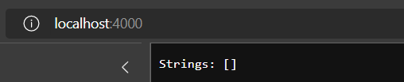

The first method we call is add, by appending `/add?s=apple` to our domain (localhost:4000):

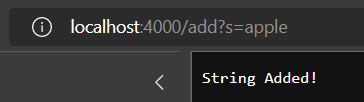

The output doesn't show the current array, but shows that the string is added to the list. The code below adds the string to the list. The `url` parameter in the `handleRequest()` method correspond to the link in the browser. The `getPath` method then only uses the path (everything after the `/` and before the `?`). If there is only a `/` then the "home page" with the current list is shown (see above image). If the path is `/add` then everything the program finds the query and splits the link based off of that. For example, based off the link in the program, the `parameters` variable would contain `["s", "apple"]`. Therefore `parameter[0]` must equal `s` in order for `parameter[1]` (which is `"apple"`) to be added to the list.

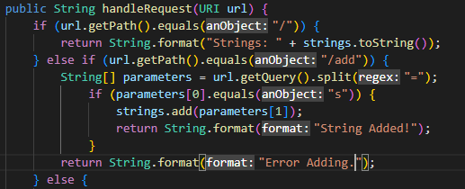

Here is another example of adding the string `"banana"` which uses the same code above.

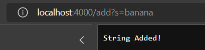

Next we can show that the "home page" works by displaying our current list after adding `"apple"` and `"banana"`.

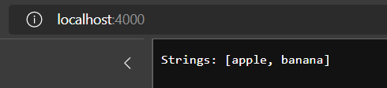

Finally, we can demonstrate `/search?s=ple`:

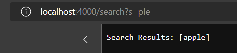

This works using the code pictured below. The `else` statement is used to capture any path isn't `/` or `/add`. If the path is `/search` then the parameters are split in a similar way as the `/add` path. Therefore the `parameters` variables contains `["s", "ple"]`, and `"ple"` is used as the search term in the `contains()` method. Everytime a string in the `strings` list contains `ple` it is added to `query` which is then printed on the screen.

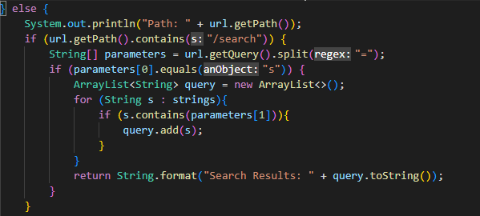


# Part 2
Choose two of the bugs from different files above. For each, show:

The failure-inducing input (the code of the test)
The symptom (the failing test output)
The bug (the code fix needed)
Then, explain the connection between the symptom and the bug. Why does the bug cause that particular symptom for that particular input?

## Bug 1

Failure Inducing Input:

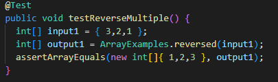

Symptom (first line of error):
```
2) testReverseMultiple(ArrayTests)
arrays first differed at element [0]; expected:<1> but was:<0> 
```
Bug:

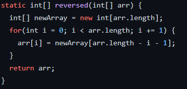

The fixed code:

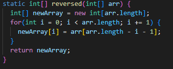

The bug in the original code is the fact that the original array in the parameter `arr` was overwritten with the `newArray`. It should be noted that when an array is initialized, it is filled with the default values of that type. An `int[]` is filled with 0s. Consequently, the value at all indices in `arr` is changed to 0. Then `arr` is return. This is the reason why the symptom shows that the acutal value was 0. In the fixed code, the values of `newArray` are changed, and `newArray` is returned, fixing the bug.

## Bug 2

Failure Inducing Input:

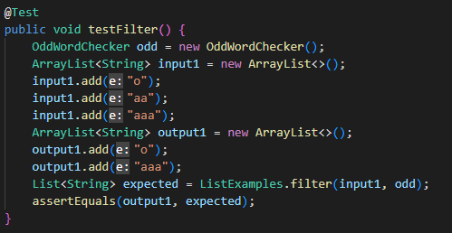

Symptom:

```
1) testFilter(ListTests)
java.lang.AssertionError: expected:<[o, aaa]> but was:<[aaa, o]>
```

Bug:

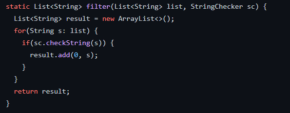

Fixed Code:

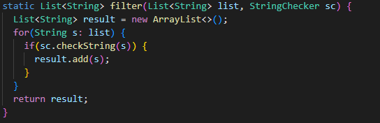

`filter` must place the items in the same order that they appeared in the original list (excluding strings that return false on `StringChecker`). For my implementation of `StringChecker`, I made a simple class that returned `true` if a string was an odd-numbered length. With the order I add the strings in my test, `input1` contains `["o", "aa", "aaa"]`. Based off the rules of `filter` and my `StringChecker` implementation, the output should be `["o", "aaa"]`, which maintains the order of the string. The bug in the original program is that `add(0, s)` is used, instead of `add(s)`. By using the first method, the string is always added to the front of the array, which violates the order of the original input. `add(s)` should be used since it preserves the order.


