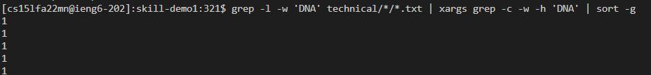

# Options using `grep`

## `-w`

1. In the example below, the term "base" is searched. Without using -w, approximately 890 files contain that word or words that contain "base". This is because words like "based" are included in the search results. The problem is that a user may prefer to search for "base" only, since it is a term used in biology and chemistry ("base pairs" or "acid and base"). By using `-w`, the search result is narrowed to 255 files with the word "base" exactly. (`-l` is what is used to output files exclusively, which prevents multiple lines from the same file counting twice).

Code Block:

``` grep -l base techincal/*/*.txt | wc```

``` grep -l -w base techincal/*/*.txt | wc```


2. In the example below, we use grep for a name, such as "John". In the second command, we search "John" without the -w option, which will then look for words that contain John. This may not be what we want, since it will search for names like Johnson and other variations. In the first command, we use `-w` when searching for John, which yields only matches for John exactly. `-l` is used in the same way as above, which only outputs the files that have the exact word John, rather than the number of lines. This can be applied to find specific names, such as if they're cited.

Code Block:

``` grep -w -l John techincal/*/*.txt | wc ```

``` grep -w John techincal/*/*.txt | wc ```

``` grep -w -l Johnson techincal/*/*.txt | wc ```


3. In combination with `-w`, `-C` (capital C!) can also be a useful tool. C stands for context, and shows an equal number of lines before and after each mention of a term. This is especially useful when searching for an exact word, and for seeing how it is used in the file. The example below shows a portion of the entire result. Using `-w` ensures we only return results using the word Darwin (as opposed to a word like Darwinism). Using `-C` reveals how the term is used in the passage. For instance, the second result seems to be more about stuttering in famous individuals than Darwin's work itself. The third results seems more relevant to Darwin's work in natural selection, which may be difficult to determine without the context option.

Code block: 

``` grep -w -C 1 Darwin techincal/*/*.txt```


# `-c`

1. The `-c` option can be used to search for the number of occurrences of a word in the given files. `-c` by itself, however, will give the number of all files, including those with 0 occurrences. It may not be helpful to show how many files have 0 occurrences of a word, so a pipe is used. First, a list of files is generated that have exactly the word matching. Then, that only that list of files is searched through for the number of occurrences of "DNA." This is practically useful since an increased count can indicate a paper more related to DNA (2 hits vs 96 hits).

Code Block: 

```grep -l -w 'DNA' technical/*/*.txt | xargs grep -c -w 'DNA'  ```


2. One may next ask how they could sort the number of occurrences in order from least to greatest. This is not that simple, since using the sort command on our output from the code before would also sort by the file names, which is not what we want. So while the first part of the command is the same, we modify the second command to exclude the file names (using `-h`) leaving only the number of occurences. We then sort this using `sort`. `-g` is used to sort in numerical order (other it uses alphabetical ordering, where 8 > 73). The second command is similar to the first, but `-h` is excluded from the second portion, which means the file names remain. The third part now searches for the term ":96". This reduces the possibility of other results showing up, since the term "96" by itself could show up in a file name, for example. The limitation of these commands is that the rest of the files would not appear, just the ones with the occurrences specifically searched by the user.

Code Block:

``` grep -l -w 'DNA' technical/*/*.txt | xargs grep -c -w -h 'DNA' | sort -g```



```grep -l -w 'DNA' technical/*/*.txt | xargs grep -c -w 'DNA' | grep :96```

(numbers before command are output from previous command above)


3. An alternative to the command above would be to find the files that mention a term at least X times. In the command below, only files where DNA is mentioned at least 50 times are listed. This is done by using the `-m` option, which caps the number of lines matched to 50 (in this example). `-c` is used to count the number of occurrences, which caps at 50. Then in the second part, we count the number of files that had DNA occurr 50 times. This is useful to find multiple files that contain a relevant term to a certain threshold, wihtout worrying about the exact amount. 

```  grep -m 50 -c -w 'DNA' technical/*/*.txt | grep :50```


## `-f`

1. `-f` is useful if there are a multitude of terms one would like to search but wouldn't want to type them into the command line every time. In the example below, `search.txt` only has the words `acid` and `base` separated by a newline. When `search.txt` is used, approximately the same amount of lines come up as the sum of acid and base individually. However, the amount of search.txt will always be equal or less, since the terms acid and base can occur in the same file.

Code Block:

``` grep -w -f search.txt technical/*/*.txt | wc ```


2. The inside of a file can also include numbers. For instance, statistical testing is used very often in studies to determine the effect of the treatment on an experimental group, compared to a control group. In the `search2.txt` folder, the number 0.05, 0.001, and 0.0005 are listed as search parameters, but this could aslo be expanded to include other numbers. By using this command, a user can quickly search for the studies which use different values, which indicate stronger or weaker statistical significance.

``` grep -w -f search2.txt technical/*/*.txt | wc ```


3. The use of a file can also be used to list names. For example, if someone wanted to find research papers mentioning certain scientists or articles mentioning certain people, they could list their names on the command line and update it continuously. Alternatively, they could keep using the same command, but just update a file with the list. The list of last names used in `search3.txt` is the same as the list of common last names found in the CSE12 Lecture 15 notes found [here](https://ucsd-cse12-f22.github.io/lectures/lecture15.html).

