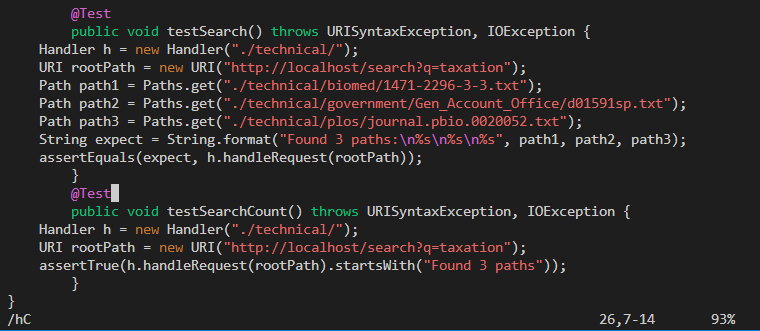
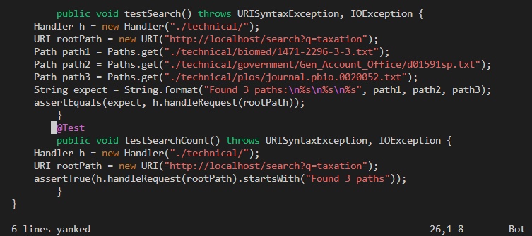
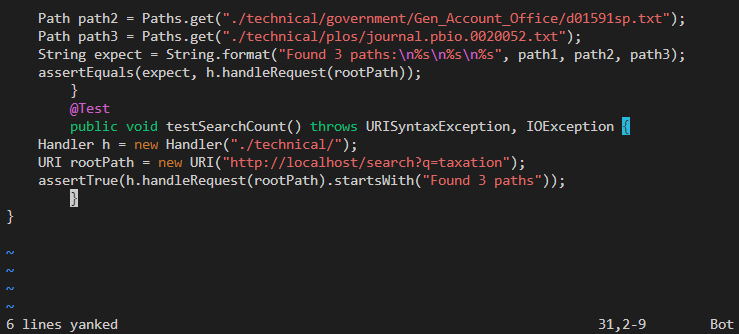
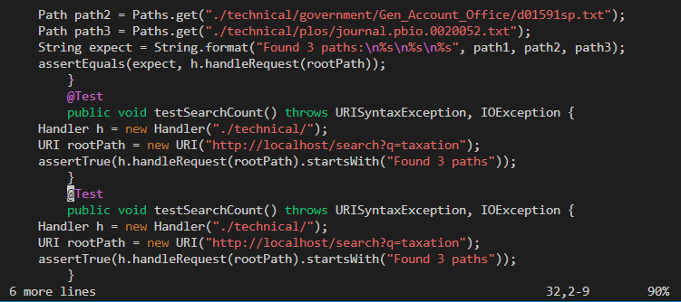
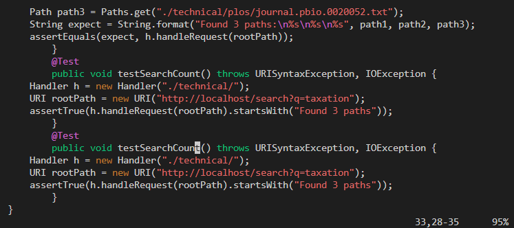
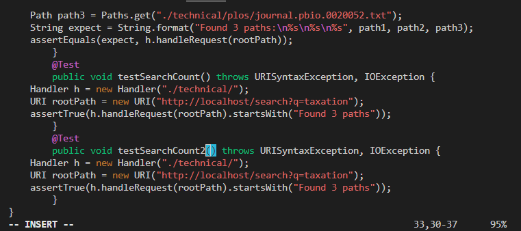
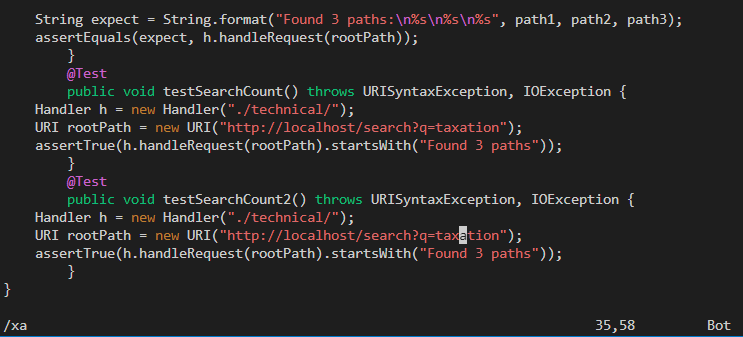
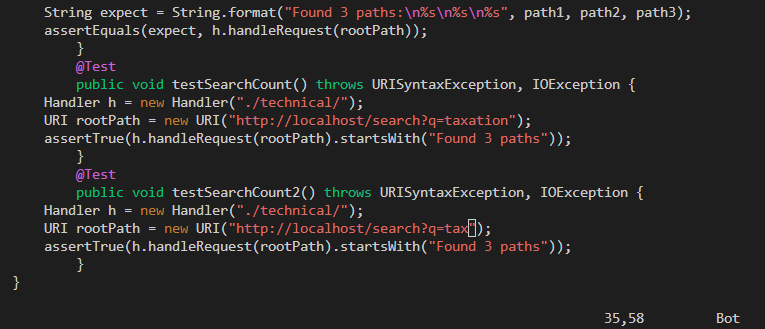
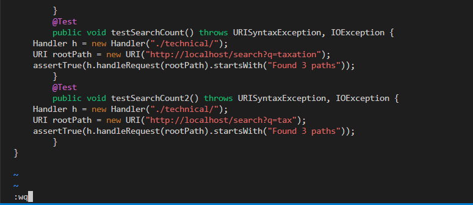

# Part 1

I performed the challenge task in Lab 6:

> Challenge: In TestDocSearch.java, copy the test called testSearchCount, rename the new test to testSearchCount2 and change the query string being tested to tax rather than taxation.

<br />
<br />

```/h<Shift-c><Enter><up><Shift-v>5jy,5j<right>p4ea2<Esc>/xalde<Shift-;>wq (30 key press)```

## ``` /h<Shift-c><Enter><up> ```
This sequences of commands first jumps to `testSearchCount()`, which is the first occurence of the sequence `hC`. Then I press `up` to go to the line with the `@Test` annotation.

Note the command at the bottom, and that the cursor is at the annotation:



## <Shift-v>5jy,5j<right>
This sequences first activates Visual Line mode using `<Shift-v>`, which higlights the current line. `5j` then moves down 5 lines (for a total of 6 lines highlighted). `y` yanks (copies) the highlighted lines, but then moves back to the top. 

Notice that the cursor is now before the `@1 symbol.



To move down five lines again, `5j` is used again. At this point, the cursor is before the closing bracket, which would be an inappropriate place to paste the copied code, so the `right` arrow key is pressed once so the bracket is highlighted.

On the image below, notice that the closing bracket is highlighted, and the message `6 lines yanked` at the bottom:



## ```p4ea2<Esc>```

`p` pastes the 6 lines currently yanked. Notice that the cursor is highlighted on the `@` symbol.



`4e` is entered to move the cursor forward to the end of the first 4 words (since the cursor was at the beginning of the first word, the cursor moves to the end of the first word once. Every other time, the cursor jumps from the end of one word to the end of the next word). 

This places the cursor at the `t`:



Next `a2` is pressed. `a` enters Insert mode, but unlike `i`, `a` moves forward one character as well. This shaves off needing to press `right` or `l` once. `2` is then inserted to the file.



## `<Esc>/xa<Enter>lde`

`<Esc>` is pressed to exit Insert mode. `/xa` in combination goes to the `x` in `taxation`. Then `l` is pressed to move one to the right. 



`de` in combination deletes the rest of the word up  (*including the current letter*) until the first non-letter symbol (which is an `"`) in this case. `tax` is all that remains.



## `<Shift-;>wq`

`<Shift-;>` inputs `:` into the vim command, and the `wq` are a single command: `:wq`. `:wq` saves and exits vim. 

Since vim is exited when I press `<Enter>`, the screenshot is taken just before I press `<Enter>`.



# Part 2

It took me about 22 seconds on VSCode to copy the `testSearchCount2` method, change the search term to `tax`, `scp` it to the remote, and run `test.sh`.

It took me about 30 seconds to add the same method using `vim` and run it using `tesh.sh`. 

The method I would edit a file I would be remotely would depend on a number of factors:
1. If I was making many small edits, I would probably use `vim`, since `vim` would run faster and it would take time to scp a large file, or many small ones. 
2. However, if I was making a larger edit (writing a new method for example), I would prefer to use an IDE. An IDE would provide feedback on any compile errors/warnings I make in the file in real-time, while `vim` does not. Therefore, I would probably spend more time compiling and then finding many small errors remotely on `vim`, rather than fixing them immeadiately on my local computer, and then `scp`-ing and testing my file once to check for any logical/runtime errors.
