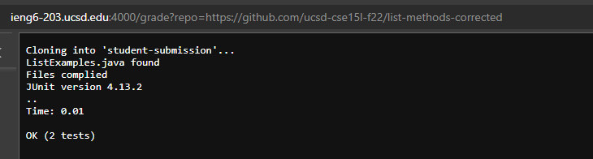
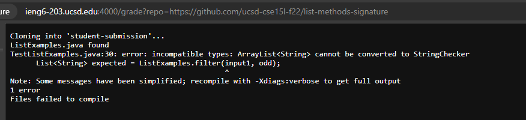
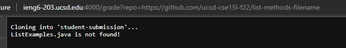

# grade.sh code
```
rm -rf student-submission

git clone $1 student-submission

cp TestListExamples.java student-submission
cp -r lib student-submission
cd student-submission


if [ -f ListExamples.java  ];
then
    echo "ListExamples.java found"
else
    echo "ListExamples.java is not found!"
    exit 1
fi

javac -cp $CPATH *.java
if [ $? -eq 0 ];
then
    echo "Files complied"
else
    echo "Files failed to compile"
    exit 1
fi
java -cp $CPATH org.junit.runner.JUnitCore TestListExamples
```

# Screenshots






# Trace

We will trace through `https://github.com/ucsd-cse15l-f22/list-methods-filename`.

`rm -rf student-submission`

This line does not print anything to standard output or stnadard error. The return code is 0, since it runs successfully without error.


`git clone $1 student-submission`

This line prints `Cloning into 'student-submission'...` and `Receiving objects: 100% (3/3), done.` to standard output and nothing to standard error. Since the command runs successfully wihtout error, the return code is 0.

`cp TestListExamples.java student-submission`

`cp -r lib student-submission`

`cd student-submission`

All of these lines send nothing to standard output or standard error, and their return code is 0.

`if [ -f ListExamples.java  ];`

This statement evaluates false since the file `ListExamples.java` could not be found. Since it wasn't found, the `else` portion of the `if` statement runs.

`echo "ListExamples.java is not found!"`
This statement sends the phrase `"ListExamples.java is not found!"` to the standard output (without quotes). Since this is done successfully, the return code of `echo` is 0.

`exit 1`
This statement causes an early exit to the script. As such, no lines afterwards are run. More specifically, the bash script has an exit code of `1` due to this statement.

